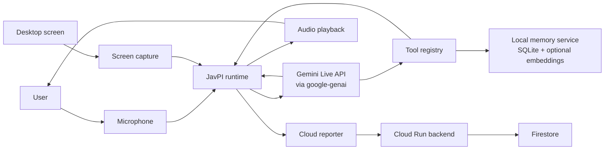

# JavPI

JavPI is a Windows-first live desktop agent built on Gemini Live. It keeps a real-time audio and vision session open, acts through a desktop tool layer, and can save structured memory that survives across sessions.

The repository is aimed at the Live Agents track of the Gemini Live Agent Challenge. The live client uses Gemini through the Google GenAI SDK, and the repo includes a Google Cloud backend that deploys to Cloud Run and writes session data to Firestore.

## Why this project exists

Most assistants still pull people back into a chat box. You stop what you are doing, explain the screen in text, ask for help, then lose the context again when the session ends.

That is a poor fit for work that is visual, interrupt-driven, or spread across tabs and apps. The useful detail is usually on screen already, and the next step is often an action, not another paragraph.

JavPI is built around that constraint. The agent listens while you work, sees the current screen, speaks back in real time, can act through tools, and can keep a small memory of things that matter.

## What the code does today

The desktop client opens a Gemini Live session and runs three loops in parallel. One loop streams microphone audio. One loop sends screenshots. One loop receives model audio, transcripts, and tool calls, then routes audio to the speaker and executes tools.

The tool layer covers window focus, browser navigation, UI targeting, typing, clipboard operations, and a set of basic file and system actions. Tool results are normalized before they go back to the model so the spoken response stays tied to what actually happened.

The memory layer is explicit and structured. The agent can save a title, summary, content, source, URL, and tags, store them in SQLite, and retrieve them later through lexical search or optional Gemini embeddings.

The cloud backend is intentionally small. It records session lifecycle and tool events in Firestore through a FastAPI service that can be deployed to Cloud Run.

## Architecture



## Runtime model

The core runtime lives in [`src/JavPI/core/javpi.py`](./src/JavPI/core/javpi.py). It owns session startup, reconnect logic, interruption handling, tool execution, and the grounding layer that rewrites overconfident model responses after failed or unverified actions.

Gemini integration lives in [`src/JavPI/gemini/client.py`](./src/JavPI/gemini/client.py). That client opens the live session, streams audio and images, and returns tool responses back to Gemini.

The memory service lives in [`src/JavPI/memory/service.py`](./src/JavPI/memory/service.py). It persists structured memories locally and can add semantic recall with Gemini embeddings when the API key is present.

## Repository layout

```text
.
|-- main.py
|-- pyproject.toml
|-- src/JavPI/
|   |-- core/javpi.py
|   |-- gemini/client.py
|   |-- audio/capture.py
|   |-- audio/playback.py
|   |-- vision/screen.py
|   |-- tools/registry.py
|   |-- memory/service.py
|   `-- cloud/reporter.py
|-- backend/
|   |-- app/main.py
|   |-- requirements.txt
|   `-- Dockerfile
|-- docs/
|   |-- agent-architecture.md
|   |-- project-story.md
|   `-- google-cloud-hosting.md
|-- scripts/deploy_cloud_run.ps1
`-- tests/
```

## Setup

The desktop runtime is Windows-first because the automation layer depends on Win32 APIs, `pyautogui`, and `pywinauto`. The shell examples below use bash syntax, but the agent itself should be run on Windows.

### Prerequisites

- Python 3.11+
- Windows desktop environment
- Gemini API key
- `pwsh` and `gcloud` if you want to deploy the backend script

### Install the desktop runtime

```bash
python3 -m venv .venv
source .venv/bin/activate || source .venv/Scripts/activate
pip install -e .
```

### Configure environment

Create a `.env` file in the project root:

```env
GEMINI_API_KEY=YOUR_GEMINI_KEY

# Optional cloud reporting
JAVPI_BACKEND_URL=
JAVPI_BACKEND_API_KEY=
JAVPI_BACKEND_TIMEOUT_SEC=1.5
JAVPI_FIRESTORE_COLLECTION=javpi_sessions

# Optional local memory path override
JAVPI_MEMORY_DB_PATH=
```

### Warm up OCR once

This avoids downloading OCR assets during the first live run.

```bash
javpi-ocr-init
```

### Run the agent

```bash
python main.py
```

Expected startup output:

- `JavPI Voice AI - Listening ...`
- `[OK] Connected`

## Tests

The repository includes targeted tests for the backend API, the cloud reporter sanitization path, and the memory service.

```bash
python -m pip install pytest
pytest tests -q
```

## Deploy the backend

The backend is a FastAPI service in [`backend/app/main.py`](./backend/app/main.py). The repository includes a deployment script for Cloud Run that also enables required services and provisions Firestore if needed.

```bash
pwsh ./scripts/deploy_cloud_run.ps1 -ProjectId <YOUR_GCP_PROJECT_ID> -Region us-central1 -ServiceName javpi-backend
```

If you want the desktop client to report sessions and tool events, set `JAVPI_BACKEND_URL` after deployment. If that variable is empty, the live agent still runs normally.

## Gemini Live Agent Challenge fit

This project maps cleanly to the Live Agents track. The core interaction model is real-time voice plus screen context, not prompt-response chat.

The code uses a Gemini model through the Google GenAI SDK. The repository also includes a Google Cloud deployment path through Cloud Run and Firestore, which covers the cloud service requirement in the challenge.

## Current scope

This is a technical prototype with a clear runtime model, a real tool layer, a local memory service, and a deployable cloud backend. The live audio, screenshot streaming, grounding pass, and memory retrieval are all implemented in code.

The current boundaries are also clear. The desktop runtime is Windows-first. The memory layer is local today. The cloud backend stores sessions and events, not shared long-term memory.

## Documentation

- [Project story](./docs/project-story.md)
- [Agent architecture](./docs/agent-architecture.md)
- [Google Cloud hosting](./docs/google-cloud-hosting.md)
