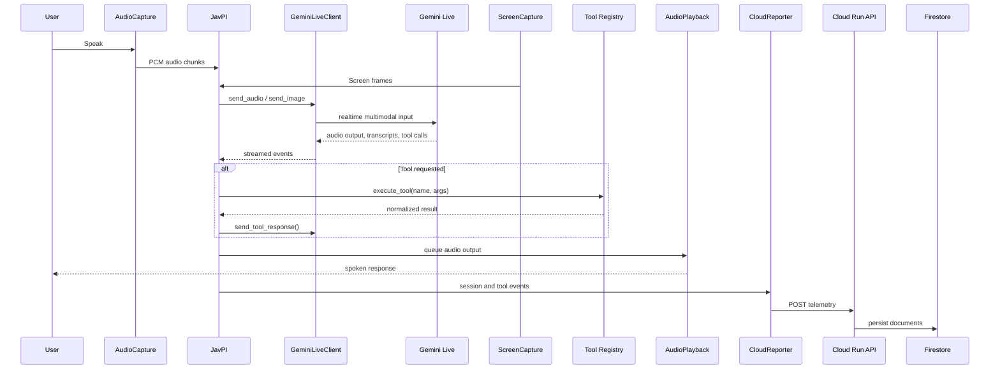

# JavPI Agent Architecture

This document describes how JavPI works as a live multimodal desktop agent and how the main runtime pieces fit together.

## One-Sentence Summary

JavPI keeps a live Gemini session open, continuously streams microphone audio and screen frames into that session, receives spoken responses and tool calls back from Gemini, persists important information into a local memory layer, and adds grounding so the assistant does not overclaim actions that were not verified.

## Design Goals

The architecture is built around five practical goals:

1. `Live by default`
   - the agent should feel continuous, not like a turn-based chatbot
2. `Grounded over fluent`
   - action accuracy matters more than smooth wording
3. `Resilient under failure`
   - reconnect instead of collapsing the whole session
4. `Low-friction deployment`
   - local desktop runtime, optional Cloud Run backend
5. `Clear extension points`
   - new tools, stricter verification, and richer analytics should be straightforward to add

## System Boundary

JavPI is split into three layers:

- `desktop runtime`
  - owns audio, screen capture, playback, and tool execution
- `Gemini Live client layer`
  - manages the realtime connection to Gemini through the Google GenAI SDK
- `optional cloud backend`
  - records session and event telemetry in Google Cloud

## Runtime Components

| Component | File | Responsibility |
| --- | --- | --- |
| Desktop entrypoint | `main.py` | Loads environment, constructs `JavPI`, starts async runtime |
| Core orchestrator | `src/JavPI/core/javpi.py` | Runs session lifecycle, concurrency, interruption logic, tool grounding |
| Gemini client | `src/JavPI/gemini/client.py` | Connects to Gemini Live, sends audio/image input, returns tool responses |
| Microphone capture | `src/JavPI/audio/capture.py` | Reads 16 kHz PCM chunks from `sounddevice` |
| Speaker playback | `src/JavPI/audio/playback.py` | Plays 24 kHz model audio and stores recent speaker audio for echo checks |
| Screen capture | `src/JavPI/vision/screen.py` | Captures full-screen frames via `mss` |
| Tool registry | `src/JavPI/tools/registry.py` | Declares and executes desktop, browser, and UI tools |
| Memory service | `src/JavPI/memory/service.py` | Stores and retrieves persistent memories with lexical and optional semantic search |
| Cloud reporter | `src/JavPI/cloud/reporter.py` | Queues and sends telemetry without blocking local interaction |
| Cloud backend | `backend/app/main.py` | Persists sessions and events to Firestore |

## High-Level Data Flow

## Session Lifecycle

### 1. Startup

`main.py` loads environment variables, checks `GEMINI_API_KEY`, constructs `JavPI`, and calls `start()`.

### 2. Session Creation

`JavPI.start()`:

- starts microphone capture
- starts speaker playback
- creates optional cloud session telemetry
- enters a reconnect loop around `_run_session()`

### 3. Live Session

`JavPI._run_session()`:

- creates a `GeminiLiveClient`
- opens a Gemini Live session
- launches three concurrent tasks:
  - `_mic_loop()`
  - `_receive_loop()`
  - `_screen_loop()`

### 4. Failure Handling

If any one of those tasks fails:

- sibling tasks are cancelled
- the session is torn down
- the outer `start()` loop reconnects with backoff

## Concurrency Model

The runtime uses an async fan-out / fan-in model:

- `mic loop`
  - pulls audio from `AudioCapture`
  - performs speech and echo analysis
  - sends valid user audio into Gemini
- `screen loop`
  - captures and compresses screenshots
  - sends frames on a fixed interval
- `receive loop`
  - consumes streamed model output
  - routes audio to playback
  - logs transcripts
  - executes tool requests

The design is intentionally simple: one session, three loops, one reconnection strategy.

## Audio Path

### Input

`AudioCapture` uses `sounddevice.InputStream` to capture mono `int16` PCM at `16 kHz`. Chunks are pushed into an in-memory queue and consumed asynchronously by `_mic_loop()`.

### Output

`AudioPlayback` uses `sounddevice.OutputStream` to play mono `float32` PCM at `24 kHz`. It also stores a rolling window of recent speaker audio so the mic loop can estimate whether detected speech is likely user speech or speaker echo.

### Interruption Logic

Interruption lives in `JavPI._mic_loop()` and related helper methods.

Signals used include:

- RMS energy
- rolling noise floor
- signal-to-noise ratio
- speech-band ratio
- VAD
- recent speaker-audio similarity

The intention is to allow user barge-in while reducing accidental self-interruptions caused by speaker playback.

## Vision Path

`ScreenCapture.capture_full()` uses `mss` to grab the primary monitor and returns an RGB `numpy` frame.

`JavPI._send_screenshot()`:

- captures the frame
- converts it to JPEG
- preserves the native screen geometry so coordinates remain aligned with tool actions
- sends the image into Gemini Live

The current runtime sends frames on a fixed interval rather than only on change. That keeps the implementation straightforward and gives the model recurring visual context.

## Tool Layer

The tool layer is defined in `src/JavPI/tools/registry.py`.

It is responsible for two things:

1. declaring tool schemas for Gemini
2. executing tool calls on the desktop

### Tool Categories

Current tools include:

- window and application control
- mouse and keyboard control
- browser navigation
- UI targeting
- file and folder operations
- clipboard operations
- basic system controls

### UI Targeting Strategy

`ui_click` is the most layered path in the system. Depending on context, it can use:

- browser-aware DOM access
- OCR targeting
- Windows UI Automation

That layered approach exists because no single desktop targeting strategy is reliable across every surface.

## Memory Layer

JavPI now includes a local persistent memory layer in `src/JavPI/memory/service.py`.

### What It Stores

Each memory record captures:

- title
- summary
- longer content
- source
- optional URL
- tags
- timestamps
- optional embedding vector

### Storage Model

- persistence: local SQLite database
- default path: `~/.javpi/memory.db`
- retrieval:
  - lexical scoring over saved fields
  - optional semantic scoring using Gemini embeddings when `GEMINI_API_KEY` is configured

### Agent Surface

The memory layer is exposed to Gemini through dedicated tools:

- `memory_save`
- `memory_search`
- `memory_recent`
- `memory_delete`

This changes JavPI from being only an execution layer into a system that can also retain and recall grounded information across sessions.

## Grounding Layer

This is one of the most important parts of the architecture.

### Why It Exists

LLMs are good at sounding completed even when tools only partially succeeded. In a live agent, that behavior is expensive because the user trusts spoken feedback as operational truth.

### How It Works

After each tool call, `JavPI` normalizes the result into a common shape:

- `status`
- `target_verified`
- `requires_visual_confirmation`
- `action_status`

Those outcomes are stored in a short rolling history. When the assistant produces text that conflicts with the most recent tool result, `JavPI` rewrites the response into a safer grounded version.

Examples:

- failed tool + confident claim -> explicit failure message
- unverified tool + confident completion language -> "attempted, not verified"

This keeps the model helpful without letting it silently replace tool truth.

## Cloud Telemetry Path

Cloud reporting is optional and isolated from the main interaction loop.

### Local Side

`CloudReporter`:

- reads configuration from environment
- sanitizes payloads
- queues events in memory
- sends them in a background thread
- retries briefly without blocking the desktop runtime

### Backend Side

`backend/app/main.py` exposes a small FastAPI service:

- `GET /healthz`
- `POST /v1/sessions/start`
- `POST /v1/sessions/{session_id}/events`
- `POST /v1/sessions/{session_id}/end`
- `GET /v1/sessions/{session_id}`

The backend writes to Firestore and can be deployed on Cloud Run.

## Failure Model

The system treats failure as a normal operating condition.

Examples:

- Gemini connection drop -> reconnect with backoff
- tool error -> structured error result back to the model
- cloud timeout -> drop or retry telemetry without stalling the user session
- oversized payload -> sanitize and truncate before sending

This keeps the local interaction path prioritized over analytics or secondary reporting.

## Current Limitations

These are intentional or known boundaries in the current implementation:

- desktop automation is Windows-first
- UI targeting latency can increase when OCR is required, especially on CPU-only systems
- persistent memory is currently local to the runtime and not synced through the cloud backend
- visual verification still depends on screenshot cadence and tool-specific signals

## Natural Next Extension

The current architecture is a strong base for deeper memory work:

- cloud-synced memory
- shared workspace memory
- source-aware recall tied to browser and document provenance
- memory compaction and ranking policies

Those would extend the current local memory layer into a broader multi-device memory system, but they are next steps, not something this repository claims to fully implement today.

## Related Docs

- [README](../README.md)
- [Google Cloud hosting](./google-cloud-hosting.md)
