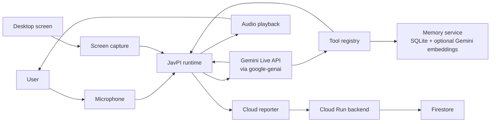
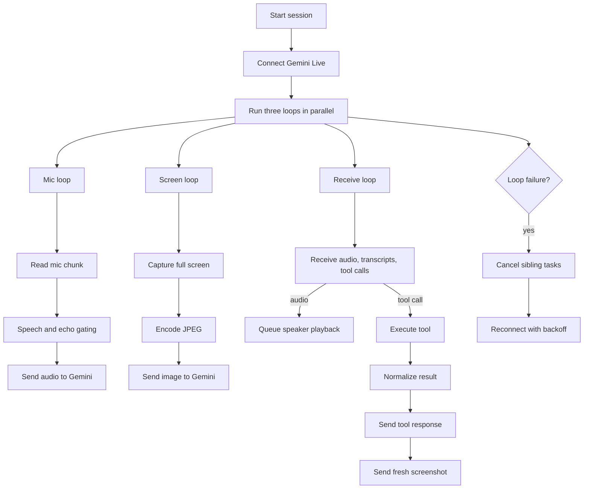

# JavPI Project Story

## Inspiration

The starting point was simple. Most assistants still force people to stop working, type a prompt, explain the screen, and then re-explain the same context again a few minutes later.

That breaks down fast in real work. Research, browsing, note-taking, and small desktop actions happen in a continuous stream. The useful detail is usually already on screen, and the important follow-up is often an action or a saved note, not another chat turn.

We wanted to build an agent that stays in that stream. It should listen while a person is talking, see the screen they are looking at, speak back immediately, act through tools, and keep track of things that should not disappear when the session ends.

## What it does

JavPI is a live desktop agent built on Gemini Live. The user speaks, the client streams microphone audio and screenshots into Gemini, and the model responds with audio, transcripts, and tool calls.

The tool layer gives the agent a way to do real work on the desktop. It can focus windows, navigate the browser, target UI elements, type, scroll, use the clipboard, and run a small set of file and system actions.

The newer part of the system is memory. The agent can now save structured information with a title, summary, content, source, URL, and tags, then retrieve it later through lexical search or optional Gemini embeddings. That gives the project continuity across sessions instead of treating every interaction as disposable.

## How we built it

The system is split into a local live client and a small cloud backend. The live client owns audio capture, audio playback, screenshot streaming, tool execution, grounding, and memory. The backend is there for session reporting and Cloud Run deployment, not for the real-time loop itself.

The core runtime is built around three parallel loops in `src/JavPI/core/javpi.py`. One loop sends microphone audio. One loop sends screenshots. One loop receives model output, routes speaker audio, and executes tool calls. Keeping those loops separate made the runtime easier to reason about and easier to recover when one part fails.

### System architecture

The tool layer is deliberately broad because desktop interaction is messy. Browser actions, UI targeting, and operating system actions all have different failure modes, so the registry normalizes results before they go back to the model.

The memory layer is deliberately narrow. It stores structured records in SQLite and scores them locally. If a Gemini API key is present, it can also request embeddings through the same SDK and blend semantic recall into the ranking step.

### Core loop

The other important part is grounding. The agent does not just execute tools and hope the model describes them correctly. Tool results are normalized into explicit states such as confirmed, executed but unverified, and failed, and the runtime can override model phrasing when it overstates what happened.

## Challenges we ran into

The first hard problem was interruption. A live voice agent needs to let the user cut in, but it also needs to avoid hearing its own speaker output and interrupting itself. That pushed the audio path toward RMS checks, VAD, noise tracking, and recent-speaker matching instead of a simple threshold.

The second hard problem was tool grounding. Desktop tools fail in uneven ways. A click can execute without visual proof. OCR can find the wrong target. A browser action can succeed locally while the model still narrates the wrong thing. We had to make tool outcomes first-class data, not just log messages.

The third hard problem was adding memory without destabilizing the live loop. The clean answer was to keep memory out of the audio path and expose it through tools. That kept the runtime model simple and made the new feature testable on its own.

## Accomplishments that we're proud of

The project now has a real live loop. Audio, screenshots, speaker output, tool calls, and reconnect behavior all exist as concrete runtime pieces with clear boundaries in the code.

We are also proud of the grounding layer. It is easy to demo a tool call and much harder to keep the model's spoken output aligned with what the tool actually did. That discipline makes the system more useful than a fluent but unreliable assistant.

The memory work is another step forward. JavPI is no longer limited to the current screen and the current turn. It can save structured context and bring it back later with source metadata attached.

## What we learned

The quality of a live agent comes from coordination more than any single model call. The model matters, but so do interruption rules, screenshot cadence, tool contracts, and recovery paths.

We also learned that memory needs structure. Dumping transcripts into storage is easy and not very useful. The moment recall starts to matter, titles, summaries, sources, tags, and ranking logic matter more than raw volume.

## What's next for JavPI

The next step is to make memory less manual. The current implementation can save and retrieve explicit memories well, but the natural extension is assisted capture during research and browsing sessions so the agent can keep the right things without being told every time.

The cloud side is the next major engineering step. The backend already stores sessions and events in Firestore and deploys cleanly to Cloud Run. The obvious follow-on is to move from local memory only to synced memory, shared retrieval, and stronger source provenance in cloud-backed workflows.

UI speed and verification still matter too. The tool layer is already broad, but faster verification and lower-latency targeting will improve both the product experience and the demo quality.
